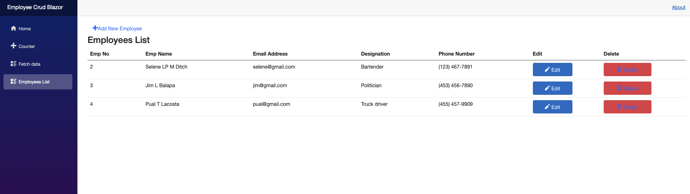
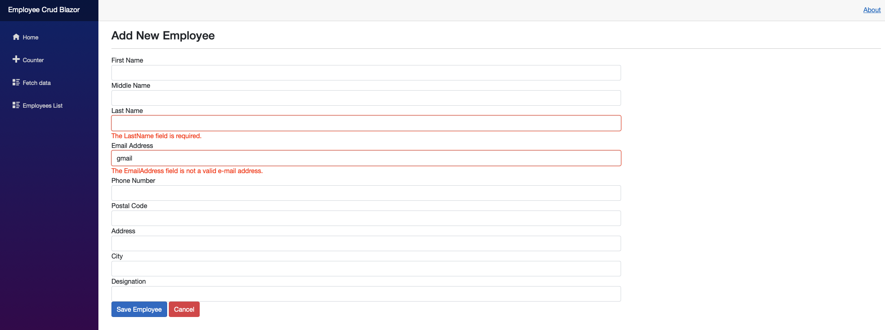
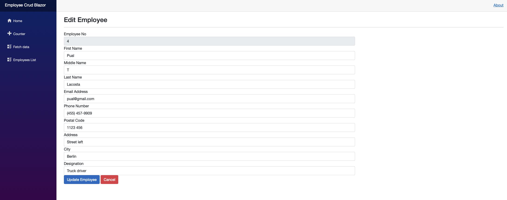
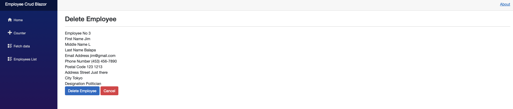

# Employee Crud Blazor

##### Overview

    - A small project in Blazor Server App. It allow to create, read, update and delete, data(information from employee) from database.

### Features

    - CRUD methods;
    - MySQL;
    - Entity Framework Core;
    - Blazor Server App;
    - .Env;

### Project Description

    - This project is made in the Blazor Server App, it shows employees information in a list. Each row is dedicated to an employee. We can add more employees, as well as update the information for a specific employee, and we can delete them. All this data is stored in the MySQL database. The forms(Add and Edit), have validation with data annotations. Using the .env file to keep the connection string a secret.

### Screenshots

    1 - List of employees with the information we want to show, in a list;

  

    2 - Page to add employee, we can see that have validations;

  

    3 - Page to edit employee;

  

    4 - Page to delete employee;

  

